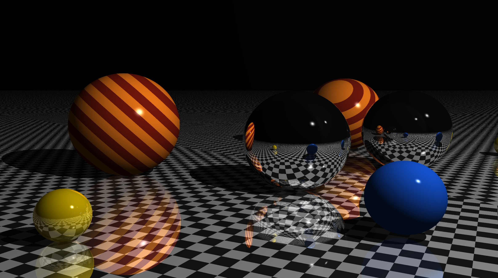

# CPU Raytracer
A CPU ray tracer implemented in **C++20**. This project is based on the Book *The Ray Tracer Challenge* by Jamis Buck and extends it with SIMD-accelerated ray-primitive intersection computations.



## Overview
This renderer implements a ray tracing algorithm executed entirely on the CPU. It supports hard shadows, Phong shading, and procedural materials.

Refraction (e.g., glass materials) is not yet implemented.

The renderer uses OpenGL only for displaying the final computed image.

Primary rays are processed in batches of 8 using SIMD intrinsics to accelerate ray–primitive intersection tests.

No external engine or rendering framework is used.

## Features
- Deterministic recursive ray tracing algorithm
- Hard shadows using point light sources
- Phong-shading model
- Procedural patterns, e.g. Striped-/Ring-/Gradient-Patterns
- SIMD-accelerated ray-sphere and ray-plane intersections for primary rays
- Multi-threading via OpenMP

## Tech Stack
- **Language:** C++20
- **Math:** GLM (OpenGL Math Library)
- **Parallelism:** OpenMP + SIMD intrinsics
- **Unit Testing:** Catch2 with CMake `CTest` integration
- **Build System:** CMake

## Benchmark data
The benchmark scene from the showcase above features 2 non-reflective spheres, 2 reflective spheres and 2 reflective planes.

- **CPU:** AMD Ryzen 7 7800X3D
- **Resolution:** 8K (7680 × 4320)
- **Recursion Depth**: 8
- **Runs:** 10
- **Avg. time per render:** 1.09 seconds
- **Rendering model:** Single-ray-per-pixel deterministic renderer (no anti-aliasing or stochastic sampling).

## Dependencies

The project requires the following system dependencies:

- CMake ≥ 3.16  
- A C++20 compatible compiler (GCC, Clang, or MSVC)  
- OpenGL development libraries  
- GLFW  
- OpenMP support  

Catch2 is automatically fetched during configuration via CMake `FetchContent` and does not need to be installed manually.

On Linux these can be fetched via a package manager, e.g. `apt` for Debian-bases distributions.

On Windows a package manager like `vcpkg` can be used.

## Running the project
```bash
git clone https://github.com/Fugi96/CPURaytracer
cd CPURaytracer
cmake -S . -B build -DCMAKE_BUILD_TYPE=Release
cmake --build build
./build/raytracer
```